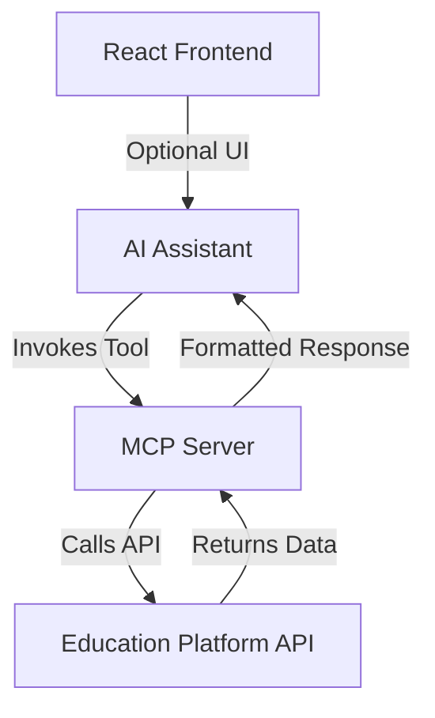

# Solution Design: MCP Server for Course Catalog Search

## Overview
This document outlines the design for a Model Context Protocol (MCP) server that provides tools for searching and listing courses from an online education platform. The server will be implemented in Node.js using the OpenAI MCP SDK, following the standards from the OpenAI documentation.

## Requirements
- **Purpose**: Allow students to quickly search for courses in a catalog based on their study needs.
- **Technology Stack**: Node.js for the MCP server backend, React.js for potential frontend integration (if needed for displaying results).
- **Standards**: Adhere to OpenAI MCP documentation and examples from the openai-apps-sdk-examples GitHub repository.
- **Functionality**: Expose a tool that queries a course catalog API and returns relevant course information.

## Architecture
The MCP server will be a local Stdio server that communicates with an AI assistant via standard input/output. It will integrate with an online education platform's API (e.g., Coursera, edX, or a custom platform) to fetch course data.

### Components
1. **MCP Server Core**: Built using @modelcontextprotocol/sdk, handles tool registration and communication.
2. **Course API Client**: Module to interact with the education platform's API.
3. **Tool Implementation**: A single tool for course search with parameters for filtering.
4. **Configuration**: Environment variables for API keys and endpoints.

### Data Flow
1. AI assistant invokes the "search_courses" tool with parameters.
2. MCP server receives the request and calls the education platform API.
3. API response is processed and formatted as JSON.
4. Formatted data is returned to the AI assistant.

## Tool Specification
**Tool Name**: search_courses

**Parameters**:
- `query` (string, optional): Search keywords (e.g., "machine learning", "python programming").
- `subject` (string, optional): Subject area (e.g., "Computer Science", "Mathematics").
- `level` (string, optional): Difficulty level ("beginner", "intermediate", "advanced").
- `duration` (number, optional): Maximum course duration in weeks.
- `provider` (string, optional): Platform provider (e.g., "Coursera", "edX").

**Response**: JSON array of course objects with fields like:
- id
- title
- description
- instructor
- duration
- level
- url
- provider

## Implementation Plan
1. Set up Node.js project with MCP SDK dependencies.
2. Implement course API client with mock/fake data initially.
3. Define and register the search tool.
4. Add error handling and validation.
5. Configure environment variables for API access.
6. Test the server locally.
7. Integrate with actual education platform API if available.

## React.js Integration
While the MCP server itself is backend-only, React.js could be used to create a frontend application that:
- Displays search results from the MCP tool.
- Provides a user interface for inputting search parameters.
- Calls the MCP server indirectly through the AI assistant.

However, since MCP is designed for AI assistants, the primary interface is through the tool API.

## Security and Best Practices
- Store API keys securely in environment variables.
- Implement rate limiting if necessary.
- Validate input parameters to prevent injection attacks.
- Follow MCP SDK best practices for tool implementation.

## Deployment
The server will be configured as a local MCP server in the user's MCP settings, similar to the weather server example.

## Next Steps
- Implement the Node.js MCP server code.
- Test with mock data.
- Integrate with real API.
- Add React frontend if required.